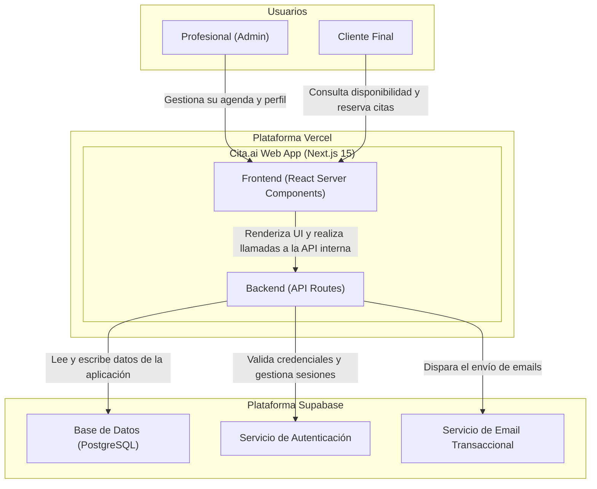
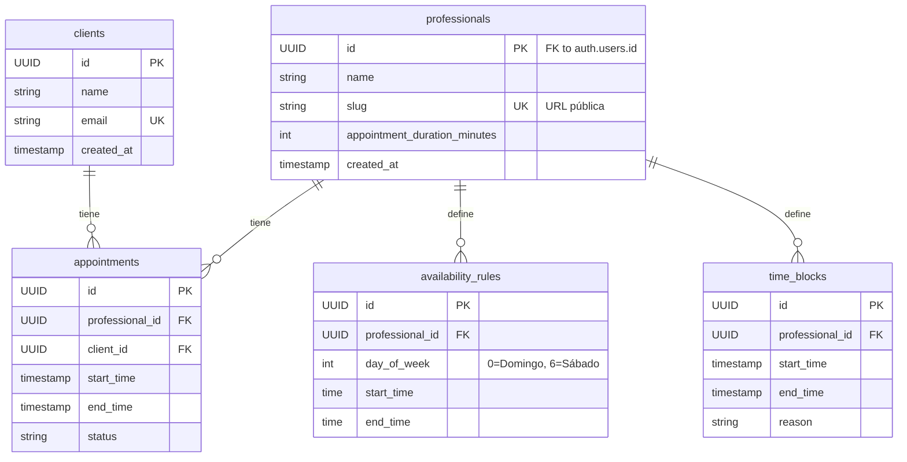
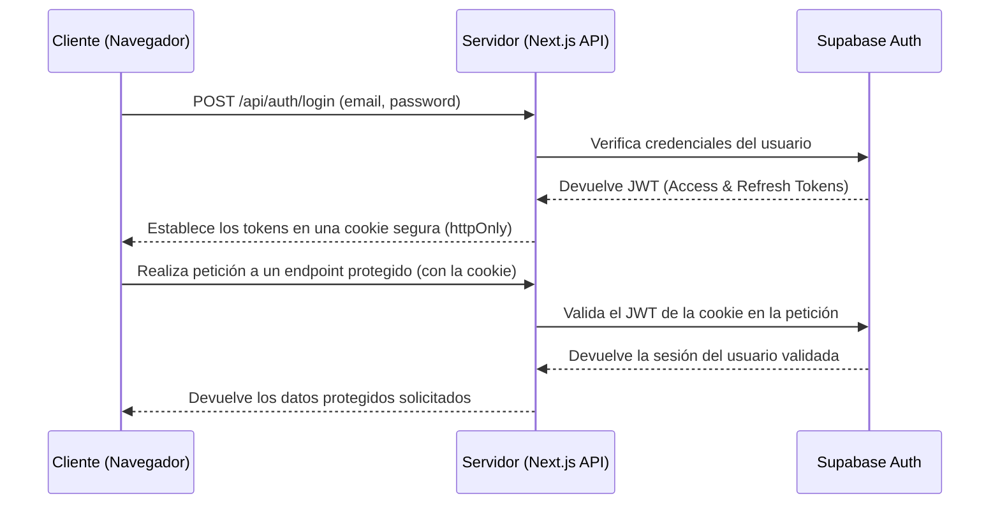

# Architecture Specifications: Cita.ai MVP

Este documento describe la arquitectura de software, el diseño de la base de datos y las decisiones técnicas para la construcción del MVP de Cita.ai, basado en el PRD y los requerimientos funcionales.

---

## 1. System Architecture

Se adopta una arquitectura de contenedores C4 (Nivel 2) para visualizar los componentes principales del sistema y sus interacciones.

**Descripción del Flujo:**
- Los usuarios (Profesionales y Clientes) interactúan con el **Frontend** de Next.js, renderizado por Vercel.
- Las acciones del usuario que requieren lógica de negocio (ej: registrarse, crear una cita) son manejadas por el **Backend** (API Routes de Next.js).
- El Backend orquesta las operaciones con los servicios de **Supabase**: gestiona usuarios con el servicio de **Auth**, almacena y recupera datos de la **Base de Datos PostgreSQL**, y utiliza el servicio de **Email** para enviar notificaciones.

---

## 2. Database Design

El siguiente Diagrama de Entidad-Relación (ERD) muestra las entidades principales para el MVP. 

**Nota Importante:** Este es un modelo conceptual. No se generarán schemas SQL estáticos. Se utilizarán las herramientas de migración y el cliente de Supabase para interactuar con la base de datos, permitiendo que el schema evolucione de forma ágil.

---

## 3. Tech Stack Justification

| Componente | Justificación de la Elección |
| :--- | :--- |
| **Frontend: Next.js 15 (App Router)** | ✅ **React Server Components (RSC):** Mejora drásticamente la performance al reducir el JavaScript enviado al cliente. ✅ **Framework Full-stack:** La integración nativa de UI y API Routes simplifica el desarrollo y el despliegue. ✅ **Ecosistema Vercel:** Despliegue y optimizaciones automáticas (ISR, Edge Network) sin configuración adicional. ❌ **Trade-off:** La curva de aprendizaje del App Router y los RSC es más pronunciada que la del Pages Router tradicional. |
| **Backend & DB: Supabase** | ✅ **Backend as a Service (BaaS):** Provee Auth, DB (PostgreSQL) y Storage listos para usar, acelerando el desarrollo del MVP. ✅ **PostgreSQL Real:** Permite usar toda la potencia de una base de datos relacional, incluyendo RLS (Row Level Security) para la seguridad de los datos. ✅ **Generoso Plan Gratuito:** Ideal para un MVP, permitiendo validar el producto con costos iniciales muy bajos. ❌ **Trade-off:** Cierta dependencia del proveedor (vendor lock-in). Menos control sobre la infraestructura de la DB en comparación con una solución auto-gestionada. |
| **Hosting: Vercel** | ✅ **Integración Perfecta con Next.js:** Creado por el mismo equipo, garantiza el mejor rendimiento y compatibilidad. ✅ **CI/CD Integrado:** Despliegues automáticos con cada push a la rama principal y creación de *preview deployments* para cada PR. ✅ **Red de Edge Global:** Asegura baja latencia para usuarios en cualquier parte del mundo sin costo adicional en el plan básico. ❌ **Trade-off:** Puede volverse costoso a medida que el tráfico y el uso de funciones serverless aumentan significativamente. |
| **CI/CD: GitHub Actions** | ✅ **Integrado en el Repositorio:** No requiere herramientas externas. Los flujos de trabajo viven junto al código. ✅ **Gran Ecosistema:** Miles de acciones pre-construidas por la comunidad para tareas como linting, testing, etc. ✅ **Flexibilidad:** Permite definir flujos de trabajo complejos más allá del simple despliegue (ej: correr tests de integración). ❌ **Trade-off:** La sintaxis YAML y la gestión de flujos complejos pueden volverse verbosas. |

---

## 4. Data Flow: Reserva de Cita

Flujo de datos para la operación más crítica: un cliente reservando una cita.

1.  **Cliente** visita la página pública `cita.ai/{slug-del-profesional}`.
2.  **Frontend (Next.js)**: La página, renderizada en el servidor (vía ISR), realiza una llamada a la API interna en `/api/availability` para obtener los horarios de la semana actual.
3.  **Backend (API Route)**: El endpoint `/api/availability` consulta a **Supabase** para obtener las reglas de disponibilidad, los bloqueos de tiempo y las citas ya existentes para ese profesional.
4.  **Supabase (PostgreSQL)**: Ejecuta las consultas y devuelve los datos al Backend.
5.  **Backend**: Calcula los slots de tiempo disponibles y los devuelve como un array JSON al Frontend.
6.  **Frontend**: Renderiza los slots disponibles en el calendario para que el cliente pueda seleccionarlos.
7.  **Cliente** selecciona un slot y envía el formulario con su nombre y email.
8.  **Frontend** realiza una petición `POST` a `/api/appointments` con los datos de la reserva.
9.  **Backend**: Valida los datos de entrada. Verifica las reglas de negocio (límite freemium, concurrencia).
10. **Backend**: Llama a Supabase para crear (o encontrar) el registro del `client` y crear el nuevo registro en la tabla `appointments`.
11. **Backend**: Dispara el evento de notificación que será procesado por **Supabase Email**.
12. **Backend** devuelve una respuesta `201 Created` al Frontend.
13. **Frontend** muestra la página de confirmación de la reserva.

---

## 5. Security Architecture

### Flujo de Autenticación (Login)

### Implementación de RBAC (Role-Based Access Control)

Para el MVP, el control de acceso se implementará directamente en la base de datos usando **Row Level Security (RLS) de PostgreSQL**, una característica clave de Supabase.

-   **Rol `professional`:** Las políticas de RLS asegurarán que un profesional autenticado solo pueda leer o modificar registros que le pertenecen. Por ejemplo, una política en la tabla `appointments` sería `(auth.uid() = professional_id)`.
-   **Rol `public_client`:** Los usuarios anónimos solo tendrán acceso de lectura a datos públicos (perfil del profesional, horarios disponibles). No tendrán acceso a tablas como `clients` o a los detalles de citas de otros.

### Protección de Datos

-   **Encriptación:** Los datos están encriptados en tránsito (HTTPS/TLS 1.3 por Vercel) y en reposo (por Supabase).
-   **Sanitización de Entradas:** Todas las entradas del usuario serán validadas y sanitizadas en el Backend (API Routes) antes de ser procesadas o guardadas en la base de datos para prevenir ataques de inyección (SQLi, XSS).